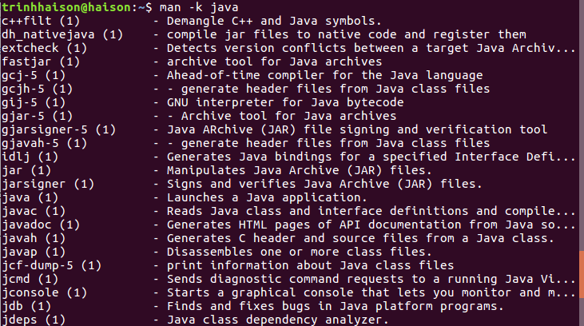
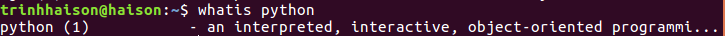
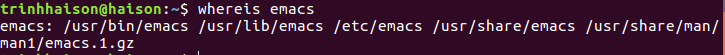
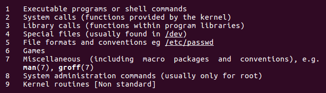
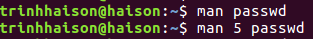
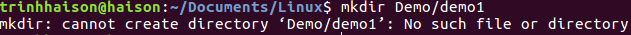

First steps on the command line
=================================

#### 1. **man pages**

**man $command:** Type man followed by a command (for which you want help) and start reading. Press q to quit the manpage. Some man pages contain examples (near the end).  

**man -k $string:** show a list of man pages containing a string  
Example:  
  
**whatis:** To see just the description of a manual page, use whatis followed by a string.  
Example:  
  
**whereis:** The location of a manpage can be revealed with whereis.  
Example:  
  
**man section:** By now you will have noticed the numbers between the round brackets. man man will explain  to  you  that  these  are section numbers. Executable programs and shell commands reside in section one.  
  
**man $section $file:** Therefor, when referring to the man page of the passwd command, you will see it written as passwd(1); when referring to the passwd file, you will see it written as passwd(5). The screenshot explains how to open the man page in the correct section.  
  

#### 2. **Working with directory**

**$pwd**: (Print Working Directory) show your current dirrectory.  
**$cd**: change your current directory  
**$cd -**: go to previous directory  
**tab key**: tab key can help you in typing a paht without errors. If you type a path to a directory correctly then when you hit tab key, a slash (/) will appear at the end of the path , if you type wrong, nothing happens. 
**ls**: list the contents of the current directory  
**ls -a**: list all files (include hidden files) and directory (include hidden directories) of the current directory  
**ls -l**: list the contents with more detail (created date, user authoriy,...) of the current directory  
**ls -lh**: look almost like ls -l but include sizes of files and directories  
**mkdir**: make your own directory.  
**mkdir -p**: this following command will fail, because the parent directory of 'demo1' does not exist  
  
when given the option -p, then mkdir will create parent directories as needed.  
**rmdir**: when the directory is empty you can remove it by rmdir command.  
**rmdir -p**: similar to mkdir -p option, you can also use rmdir -p to recursively remove directories.  
#### 3. **Working with file**

Files on Linux (or any Unix) are case sensitive. This means that FILE1 is different from file1, and /etc/hosts is different from 
/etc/Hosts (the latter one does not exist on a typical Linux computer).  
In Linux,everything is a file. A directory is a special kind of file, but it is still a (case sensitive!) file. Each  terminal window (for example /dev/pts/4), any hard disk or partition (for example /dev/sdb1) and any process are all represented somewhere in the file system as a file. 

