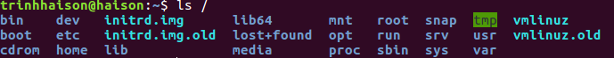

The Linux file tree
======================

#### 1. **The root directory**

All Linux systems have a directory structure that starts at the root directory. The root directory is represented by a forward slash, like this: 
/. Everything that exists on your Linux system can be found below this root directory. Let's take a brief look at the contents of the
root directory.  

